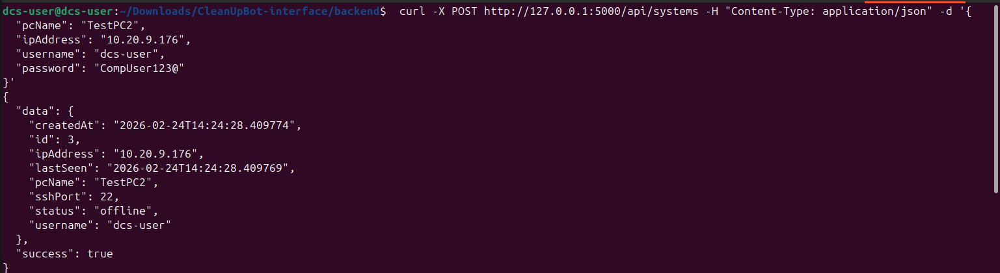
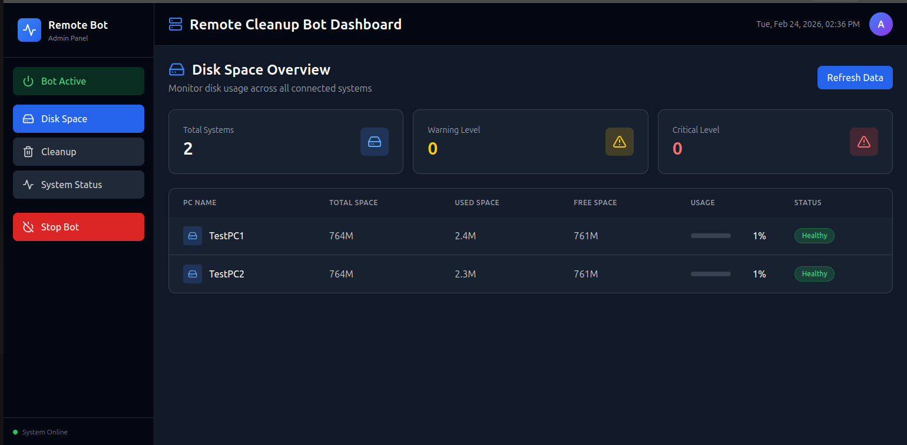
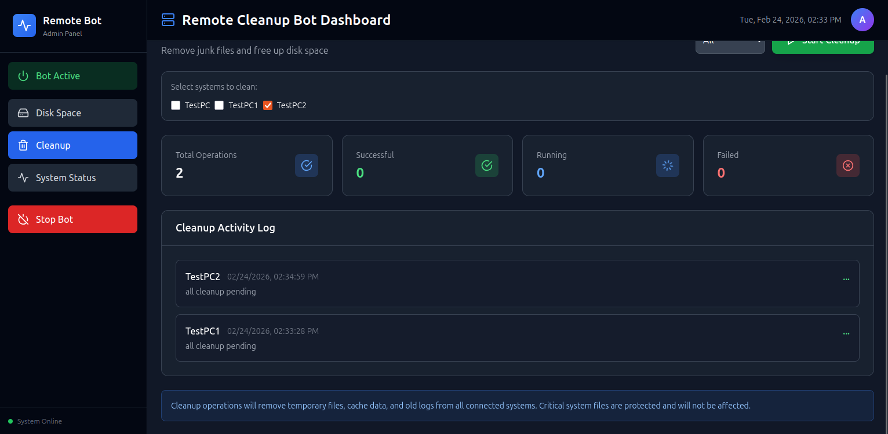
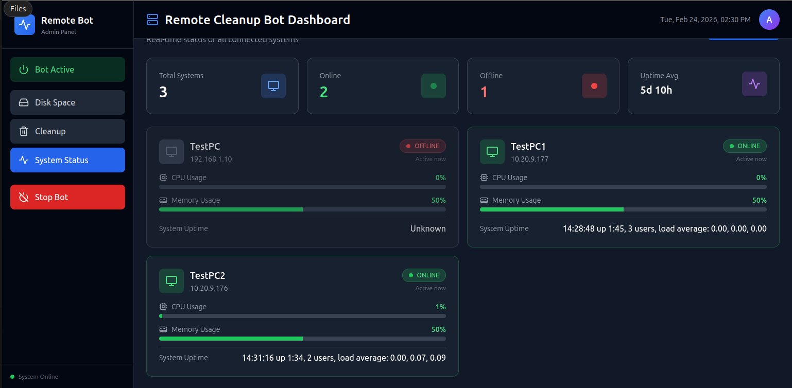

# Remote Cleanup Bot

## Project Description

### Problem Statement

In many Local Area Networks (LANs) such as offices, labs, and
institutions, multiple computers accumulate temporary files, cache, and
junk data over time. These unnecessary files consume disk space, reduce
system performance, and require manual cleanup on each machine. Manually
maintaining multiple systems is inefficient and time‑consuming for
administrators.

### Objectives

-   Provide centralized remote system maintenance.
-   Automatically clean cache and junk files from remote computers.
-   Monitor system resources such as CPU, memory, and disk usage.
-   Simplify LAN system administration through a centralized dashboard.

### Target Users

-   System Administrators
-   IT Support Teams
-   Educational Computer Labs
-   Small Office Networks

### Overview

Remote Cleanup Bot is a centralized system that allows administrators to
remotely manage and clean Linux systems connected within a LAN. The
system uses SSH connections to securely access remote machines and
execute cleanup commands.

A React-based dashboard allows administrators to register remote
systems, monitor system status, view resource usage, and trigger cleanup
operations. The backend is implemented using Python and uses the
Paramiko SSH library to communicate with remote machines.

------------------------------------------------------------------------

# System Architecture / Design

## Workflow

1.  Administrator opens the React dashboard.
2.  Administrator registers a remote PC by providing:
    -   PC Name
    -   IP Address
    -   Username
    -   Password
3.  Frontend sends the data to the Python backend API.
4.  Backend stores the system information.
5.  Using Paramiko, the backend establishes an SSH connection.
6.  Cleanup commands are executed on the remote system.
7.  System metrics (CPU, Memory, Disk) are collected.
8.  Results are returned to the dashboard.

## Architecture Diagram

React Frontend → REST API → Python Backend → SSH (Paramiko) → Remote
Linux PCs

------------------------------------------------------------------------

# Technologies Used

## Programming Languages

-   Python
-   JavaScript

## Frontend

-   React
-   Vite

## Backend

-   Python API Server

## Libraries

-   Paramiko (SSH communication)

## Tools

-   Git
-   Linux
-   REST APIs

------------------------------------------------------------------------

# Installation Instructions

## Prerequisites

Make sure the following are installed:

-   Node.js
-   npm
-   Python 3.x
-   pip
-   Git
-   Linux environment

------------------------------------------------------------------------

# Frontend Setup

Navigate to the frontend folder:

cd frontend

Install dependencies:

npm install

Run the development server:

npm run dev

------------------------------------------------------------------------

# Backend Setup

Navigate to backend folder:

cd backend

Create virtual environment:

python -m venv venv

Activate virtual environment:

Linux / Mac source venv/bin/activate

Windows venv`\Scripts`{=tex}`\activate`{=tex}

Install dependencies:

pip install -r requirements.txt

Run the backend:

python run.py

------------------------------------------------------------------------

# Usage Instructions

## Add a Remote System

Example API request:

curl -X POST http://127.0.0.1:5000/api/systems\
-H "Content-Type: application/json"\
-d '{ "pcName": "TestPC2", "ipAddress": "10.20.9.176", "username":
"dcs-user", "password": "CompUser-123@" }'

Example response:

{ "data": { "id": 3, "pcName": "TestPC2", "ipAddress": "10.20.9.176",
"status": "offline" }, "success": true }

## Dashboard Features

After adding systems, the GUI dashboard shows:

-   System status
-   Disk space
-   CPU usage
-   Memory usage
-   Cleanup results

Administrators can trigger cleanup operations remotely.

------------------------------------------------------------------------

# Dataset

This project does not use a dataset. Instead, it collects live system
data from remote machines using SSH.

------------------------------------------------------------------------

# Project Structure

remote-cleanup-bot

frontend/ - src/ - public/ - package.json - vite.config.js

backend/ - api/ - services/ - models/ - run.py - requirements.txt

README.md LICENSE

------------------------------------------------------------------------

# Screenshots / Demo

## Add Remote System

## Disk Space

## Cleanup Results

## System Status

------------------------------------------------------------------------

# Contributors

- Vinuki Samaraweera : System Design, Backend Development
- Bihari Fernando : Frontend Development
- Tharushi Dilhara :  Frontend Development 
- Manodya Wickramasinghe : Backend Development
- Malshi Wijesinghe : Backend Development

------------------------------------------------------------------------

# Contact Information

Name: Tharushi Dilhara
Email: tharushidilhara881@gmail.com
Institution: University of Jaffna

------------------------------------------------------------------------

# Licence

MIT License

Permission is granted to use, copy, modify, merge, publish, distribute,
sublicense, and/or sell copies of the software.
